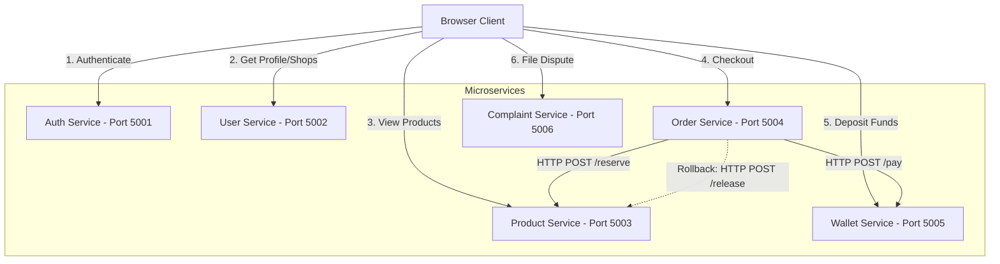

# Microservices Developer Handbook

This handbook is designed as a practical, concise reference to guide the implementation of each of the 6 PHP microservices. Keep it open alongside your IDE during development.

---

# Auth Service

## 1. Purpose
Responsible for user account creation, credentials verification, password hashing, and issuing signed JWT access tokens.

---

## 2. Database Tables

| Table | Purpose |
| :--- | :--- |
| **`Users`** | Stores user identity info (Username, Email, password hash, RoleID, IsBlocked) |
| **`Roles`** | Stores role descriptions (Admin, Seller, Buyer) |

---

## 3. Public APIs

| Method | Endpoint | Purpose | Success | Error Codes |
| :--- | :--- | :--- | :--- | :--- |
| `POST` | `/api/users` | Register a new account | `201 Created` | `400 Bad Request` (Validation/Email taken) |
| `POST` | `/api/users/login` | Log in and receive JWT token | `200 OK` | `400 Bad Request`, `401 Unauthorized` (Invalid credentials) |

### API Payload Schema

#### `POST /api/users`
* **Request JSON:**
  ```json
  {
    "username": "malek_seller",
    "email": "malek.seller@example.com",
    "password": "SecurePassword123",
    "roleId": 2
  }
  ```
* **Response JSON:**
  ```json
  {
    "message": "User registered successfully",
    "user": {
      "userId": 1,
      "username": "malek_seller",
      "email": "malek.seller@example.com",
      "roleId": 2
    }
  }
  ```

#### `POST /api/users/login`
* **Request JSON:**
  ```json
  {
    "email": "malek.seller@example.com",
    "password": "SecurePassword123"
  }
  ```
* **Response JSON:**
  ```json
  {
    "message": "Login successful",
    "token": "eyJhbGciOiJIUzI1NiIsInR5cCI6IkpXVCJ9.eyJ1c2VySWQiOjEsIm..."
  }
  ```

---

## 4. Communication With Other Services
*None. The Auth Service acts as an independent authentication provider.*

---

## 5. Saga / Rollback
*None. Auth Service does not participate in any multi-step transaction Sagas.*

---

## 6. Development Order
1. Models (`User.php`)
2. Repository (`UserRepository.php`)
3. Service (`AuthService.php`)
4. Controller (`AuthController.php`)
5. Routes (`public/index.php`)
6. Test APIs

---

## 7. Testing Checklist
* [ ] Register user as Buyer (`roleId: 3`)
* [ ] Register user as Seller (`roleId: 2`)
* [ ] Register with duplicate email error check
* [ ] Register with missing fields validation check
* [ ] Log in with valid credentials (JWT token returned)
* [ ] Log in with wrong credentials error check

---

## 8. Notes
* Never return password hashes in any response.
* Passwords must be hashed using PHP's native `password_hash($pass, PASSWORD_BCRYPT)`.
* Secret key for JWT generation must match the secret key used by all other services.

---
---

# User Service

## 1. Purpose
Responsible for retrieving and managing public/private user profiles, updating merchant shop profiles (with logo file uploads), and executing administrator-driven account or storefront blocks.

---

## 2. Database Tables

| Table | Purpose |
| :--- | :--- |
| **`Users`** | Reads profile parameters; updates `IsBlocked` status |
| **`Shops`** | Stores seller store metadata (ShopName, Description, LogoUrl, IsBlocked) |

---

## 3. Public APIs

| Method | Endpoint | Purpose | Success | Error Codes |
| :--- | :--- | :--- | :--- | :--- |
| `GET` | `/api/users/profile` | Get logged-in user profile | `200 OK` | `401 Unauthorized` |
| `GET` | `/api/users/:id` | Get specific public profile | `200 OK` | `404 Not Found` |
| `GET` | `/api/shops` | List all active storefronts | `200 OK` | `500 Server Error` |
| `GET` | `/api/shops/:id` | Get details of a single shop | `200 OK` | `404 Not Found` |
| `GET` | `/api/shops/my-shop-details`| Retrieve logged-in seller's shop | `200 OK` | `401 Unauthorized`, `404 Not Found` |
| `PUT` | `/api/shops/my-shop` | Update shop details (supports logo upload) | `200 OK` | `400 Bad Request`, `401 Unauthorized` |
| `GET` | `/api/users` | Admin lists all users | `200 OK` | `401 Unauthorized`, `403 Forbidden` |
| `GET` | `/api/admin/sellers` | Admin lists all active/blocked sellers | `200 OK` | `401 Unauthorized`, `403 Forbidden` |
| `GET` | `/api/admin/buyers` | Admin lists all active/blocked buyers | `200 OK` | `401 Unauthorized`, `403 Forbidden` |
| `PUT` | `/api/admin/users/block` | Admin toggle block/unblock user | `200 OK` | `400 Bad Request`, `403 Forbidden` |
| `PUT` | `/api/admin/shops/block` | Admin toggle block/unblock shop | `200 OK` | `400 Bad Request`, `403 Forbidden` |

### API Payload Schema

#### `GET /api/users/profile`
* **Request JSON:** *None (Send Bearer Token in Header)*
* **Response JSON:**
  ```json
  {
    "userId": 1,
    "username": "malek_seller",
    "email": "malek.seller@example.com",
    "isBlocked": false,
    "roleName": "Seller"
  }
  ```

#### `PUT /api/shops/my-shop`
* **Request multipart/form-data:**
  * Field: `shopName` -> `"Brilliant Tech Store"`
  * Field: `description` -> `"Specialized in high quality electronics"`
  * File: `logo` -> *(Binary upload)*
* **Response JSON:**
  ```json
  {
    "message": "Shop updated successfully!",
    "shop": {
      "shopId": 1,
      "sellerId": 1,
      "shopName": "Brilliant Tech Store",
      "description": "Specialized in high quality electronics",
      "logoUrl": "/uploads/172228_logo.png",
      "isBlocked": false,
      "sellerName": "malek_seller"
    }
  }
  ```

#### `PUT /api/admin/users/block`
* **Request JSON:**
  ```json
  {
    "userId": 4,
    "isBlocked": true
  }
  ```
* **Response JSON:**
  ```json
  {
    "message": "User block status updated successfully."
  }
  ```

---

## 4. Communication With Other Services
*None. All calls to profile or shop directories are direct client-to-service requests.*

---

## 5. Saga / Rollback
*None. The User Service does not participate in multi-service Sagas.*

---

## 6. Development Order
1. Models (`User.php`, `Shop.php`)
2. DTOs (`UpdateShopDTO.php`, `BlockUserDTO.php`, `BlockShopDTO.php`)
3. Repositories (`ProfileRepository.php`, `ShopRepository.php`)
4. Middleware (`JwtMiddleware.php`)
5. Services (`ProfileService.php`, `ShopService.php`)
6. Controllers (`ProfileController.php`, `ShopController.php`)
7. Routes (`public/index.php`)
8. Test APIs

---

## 7. Testing Checklist
* [ ] Retrieve user profile with correct Bearer Token
* [ ] Fail user profile retrieve with no/invalid token (returns `401`)
* [ ] Retrieve active shops list (returns list of active, non-blocked shops)
* [ ] Update shop details including logo binary image upload
* [ ] Admin block user account and confirm they can no longer log in
* [ ] Admin block shop storefront and verify it disappears from active list

---

## 8. Notes
* Do not expose credentials or password hashes.
* File uploads are saved in `public/uploads/` on the server disk.
* Admin operations verify that the parsed JWT token contains `roleId = 1`.

---
---

# Product Service

## 1. Purpose
Responsible for browsing and editing inventory catalog, handling product image file uploads, and executing stock reservation and compensation steps during checks.

---

## 2. Database Tables

| Table | Purpose |
| :--- | :--- |
| **`Products`** | Stores product details (SellerID, ProductName, Description, Price, Quantity, ImageUrl, IsDeleted) |

---

## 3. Public APIs

| Method | Endpoint | Purpose | Success | Error Codes |
| :--- | :--- | :--- | :--- | :--- |
| `GET` | `/api/products` | Get all non-deleted products | `200 OK` | `500 Server Error` |
| `GET` | `/api/products/:id` | Get details of a single product | `200 OK` | `404 Not Found` |
| `GET` | `/api/products/shop/:shopId` | List paginated products in shop | `200 OK` | `500 Server Error` |
| `GET` | `/api/products/seller` | Get logged-in seller's products | `200 OK` | `401 Unauthorized` |
| `POST` | `/api/products` | Add a new product (supports image upload) | `201 Created` | `400 Bad Request`, `401 Unauthorized` |
| `PUT` | `/api/products/:id` | Update product details | `200 OK` | `400 Bad Request`, `401 Unauthorized`, `403 Forbidden` |
| `DELETE` | `/api/products/:id` | Soft delete a product | `200 OK` | `400 Bad Request`, `401 Unauthorized` |
| `POST` | `/api/products/reserve` | Lock stock levels (Internal checkout step) | `200 OK` | `400 Bad Request` (Out of stock) |
| `POST` | `/api/products/release` | Restore stock levels (Saga rollback step) | `200 OK` | `400 Bad Request` |

### API Payload Schema

#### `GET /api/products/shop/1?page=1&limit=5`
* **Request Query String:** `page=1&limit=5`
* **Response JSON:**
  ```json
  [
    {
      "productId": 10,
      "sellerId": 1,
      "productName": "Leather Wallet",
      "description": "Genuine leather minimalist wallet",
      "price": 24.99,
      "quantity": 30,
      "imageUrl": "/uploads/172228_wallet.png",
      "isDeleted": false,
      "createdAt": "2026-07-30 12:00:00"
    }
  ]
  ```

#### `POST /api/products`
* **Request multipart/form-data:**
  * Field: `productName` -> `"Pro Wireless Headphones"`
  * Field: `description` -> `"Active Noise Canceling"`
  * Field: `price` -> `149.99`
  * Field: `quantity` -> `50`
  * File: `image` -> *(Binary upload)*
* **Response JSON:**
  ```json
  {
    "message": "Product created successfully!",
    "product": {
      "productId": 12,
      "sellerId": 1,
      "productName": "Pro Wireless Headphones",
      "description": "Active Noise Canceling",
      "price": 149.99,
      "quantity": 50,
      "imageUrl": "/uploads/172230_headphone.png",
      "isDeleted": false,
      "createdAt": "2026-07-30 15:10:00"
    }
  }
  ```

#### `POST /api/products/reserve`
* **Request JSON:**
  ```json
  {
    "items": [
      { "productId": 12, "quantity": 2 },
      { "productId": 10, "quantity": 1 }
    ]
  }
  ```
* **Response JSON:**
  ```json
  {
    "message": "Stock reserved successfully."
  }
  ```

---

## 4. Communication With Other Services
*None. Product Service is a target service called by the Saga Orchestrator.*

---

## 5. Saga / Rollback

| Step | Action | Rollback Endpoint | Triggered By |
| :--- | :--- | :--- | :--- |
| **Step 1** | Reserve items inventory | `POST /api/products/release` | Called by **Order Service** if subsequent payment steps fail |

---

## 6. Development Order
1. Models (`Product.php`)
2. DTOs (`CreateProductDTO.php`, `UpdateProductDTO.php`, `ReserveStockDTO.php`, `ReleaseStockDTO.php`)
3. Repository (`ProductRepository.php`)
4. Middleware (`JwtMiddleware.php`)
5. Service (`ProductService.php`)
6. Controller (`ProductController.php`)
7. Routes (`public/index.php`)
8. Test APIs

---

## 7. Testing Checklist
* [ ] Add product with valid inputs (returns `201`)
* [ ] Fail product update if requesting user does not own it (returns `403`)
* [ ] Verify deleting a product performs a soft-delete (sets `IsDeleted = 1`)
* [ ] Reserve stock for multiple products and verify quantities decrement
* [ ] Fail reservation if quantity exceeds available stock (rolls back all changes)
* [ ] Release stock and verify original quantities are restored

---

## 8. Notes
* Soft-deleted items must be excluded from public catalog queries.
* Reservation and Release methods must use database transactions (`PDO->beginTransaction()`) to guarantee atomicity.

---
---

# Order Service

## 1. Purpose
Acts as the central **Saga Orchestrator** for user checkouts. It manages order logs and coordinates transactions between Product Service and Wallet Service.

---

## 2. Database Tables

| Table | Purpose |
| :--- | :--- |
| **`Orders`** | Stores the core order details (BuyerID, TotalPrice, Status ['Pending', 'Completed', 'Failed']) |
| **`OrderItems`** | Stores reference, quantity, and individual price of purchased products |

---

## 3. Public APIs

| Method | Endpoint | Purpose | Success | Error Codes |
| :--- | :--- | :--- | :--- | :--- |
| `POST` | `/api/orders` | Checkout shopping basket (Starts Saga) | `201 Created` | `400 Bad Request` (Stock/Funds issues), `401 Unauthorized` |
| `GET` | `/api/orders` | Fetch logged-in user's order history | `200 OK` | `401 Unauthorized` |
| `GET` | `/api/orders/:id` | Fetch details of a specific order | `200 OK` | `404 Not Found` |

### API Payload Schema

#### `POST /api/orders`
* **Request JSON:**
  ```json
  {
    "items": [
      { "productId": 12, "quantity": 2, "price": 149.99 },
      { "productId": 10, "quantity": 1, "price": 24.99 }
    ]
  }
  ```
* **Response JSON:**
  ```json
  {
    "message": "Order placed successfully",
    "orderId": 45
  }
  ```

---

## 4. Communication With Other Services

| Calls Service | Endpoint | Why | On Failure |
| :--- | :--- | :--- | :--- |
| **Product Service** | `POST /api/products/reserve` | Deduct quantities from inventory | Set order to `Failed`, reject checkout |
| **Wallet Service** | `POST /api/wallet/pay` | Charge buyer wallet balance | Call Product Service `/release` rollback, set order to `Failed` |

---

## 5. Saga / Rollback
*The Order Service is the **Orchestrator** of the Checkout Saga. It does not receive rollback requests; it triggers them.*

---

## 6. Development Order
1. Models (`Order.php`, `OrderItem.php`)
2. DTOs (`CreateOrderDTO.php`)
3. Repository (`OrderRepository.php`)
4. Middleware (`JwtMiddleware.php`)
5. Service (`OrderService.php` - *contains the cURL Orchestration logic*)
6. Controller (`OrderController.php`)
7. Routes (`public/index.php`)
8. Test APIs

---

## 7. Testing Checklist
* [ ] Order checkout with available stock and balance (Marks order `Completed`)
* [ ] Order checkout with insufficient product stock (Fails; order marked `Failed`)
* [ ] Order checkout with insufficient buyer balance (Fails; rolls back reserved product stock)
* [ ] Verify database does not save partial data on rollbacks
* [ ] Retrieve buyer order logs history

---

## 8. Notes
* Order Service uses synchronous `cURL` calls to communicate with the other services.
* Decoupled architecture: Order Service must never execute SQL queries on the `Products` or `Wallets` tables.

---
---

# Wallet Service

## 1. Purpose
Manages client wallet balances, handles deposit logs, and provides internal step/compensating APIs to deduct or refund money during checkouts.

---

## 2. Database Tables

| Table | Purpose |
| :--- | :--- |
| **`Wallets`** | Stores user balance (UserID, Balance) |
| **`Transactions`** | Logs balance movements (WalletID, Amount, Type ['Deposit', 'Payment', 'Refund'], Description) |

---

## 3. Public APIs

| Method | Endpoint | Purpose | Success | Error Codes |
| :--- | :--- | :--- | :--- | :--- |
| `POST` | `/api/wallet/deposit` | Add funds to wallet balance | `200 OK` | `400 Bad Request`, `401 Unauthorized` |
| `GET` | `/api/wallet/balance` | Fetch logged-in user balance | `200 OK` | `401 Unauthorized` |
| `POST` | `/api/wallet/pay` | Deduct payment (Internal checkout step) | `200 OK` | `400 Bad Request` (Insufficient funds) |
| `POST` | `/api/wallet/refund` | Refund payment (Saga rollback step) | `200 OK` | `400 Bad Request` |

### API Payload Schema

#### `POST /api/wallet/deposit`
* **Request JSON:**
  ```json
  {
    "amount": 250.00
  }
  ```
* **Response JSON:**
  ```json
  {
    "message": "Deposit successful",
    "balance": 350.00
  }
  ```

#### `POST /api/wallet/pay`
* **Request JSON:**
  ```json
  {
    "userId": 3,
    "amount": 324.97,
    "orderId": 45
  }
  ```
* **Response JSON:**
  ```json
  {
    "message": "Payment processed successfully."
  }
  ```

---

## 4. Communication With Other Services
*None. Wallet Service is a target service called by the Saga Orchestrator.*

---

## 5. Saga / Rollback

| Step | Action | Rollback Endpoint | Triggered By |
| :--- | :--- | :--- | :--- |
| **Step 2** | Charge buyer balance | `POST /api/wallet/refund` | Called by **Order Service** if subsequent order creation steps fail |

---

## 6. Development Order
1. Models (`Wallet.php`, `Transaction.php`)
2. DTOs (`DepositDTO.php`, `PaymentDTO.php`, `RefundDTO.php`)
3. Repository (`WalletRepository.php`)
4. Middleware (`JwtMiddleware.php`)
5. Service (`WalletService.php`)
6. Controller (`WalletController.php`)
7. Routes (`public/index.php`)
8. Test APIs

---

## 7. Testing Checklist
* [ ] Fetch wallet balance (initialized to `0.00` for new users)
* [ ] Deposit positive funds successfully (verifies database balance increase)
* [ ] Fail deposit if amount is negative or zero
* [ ] Internal pay deducts money and adds a `Payment` transaction record
* [ ] Fail internal pay if balance is insufficient (returns `400`)
* [ ] Refund updates wallet balance up and logs a `Refund` transaction record

---

## 8. Notes
* Wallet balance manipulations must be wrapped in transactions (`PDO->beginTransaction()`) to ensure absolute precision.
* Prevent decimal floating errors by parsing dollar amounts into standard floats or integers representing cents.

---
---

# Complaint Service

## 1. Purpose
Allows buyers to file formal dispute tickets against shops and lets administrators retrieve and resolve complaints.

---

## 2. Database Tables

| Table | Purpose |
| :--- | :--- |
| **`Complaints`** | Stores complaint files (BuyerID, ShopID, Title, Description, Status ['Pending', 'Resolved']) |

---

## 3. Public APIs

| Method | Endpoint | Purpose | Success | Error Codes |
| :--- | :--- | :--- | :--- | :--- |
| `POST` | `/api/complaints` | File a new complaint against a shop | `201 Created` | `400 Bad Request`, `401 Unauthorized` |
| `GET` | `/api/complaints` | Get buyer's filed complaints | `200 OK` | `401 Unauthorized` |
| `GET` | `/api/admin/complaints` | Admin views all complaints | `200 OK` | `401 Unauthorized`, `403 Forbidden` |
| `PUT` | `/api/admin/complaints/resolve`| Admin resolves a complaint | `200 OK` | `400 Bad Request`, `403 Forbidden` |

### API Payload Schema

#### `POST /api/complaints`
* **Request JSON:**
  ```json
  {
    "shopId": 1,
    "title": "Item never arrived",
    "description": "Ordered headphones 2 weeks ago but haven't received them."
  }
  ```
* **Response JSON:**
  ```json
  {
    "message": "Complaint filed successfully."
  }
  ```

---

## 4. Communication With Other Services
*None. All dispute processes are handled locally by reading/writing to the Complaints table.*

---

## 5. Saga / Rollback
*None. Complaint Service does not participate in Saga transactions.*

---

## 6. Development Order
1. Models (`Complaint.php`)
2. DTOs (`CreateComplaintDTO.php`, `ResolveComplaintDTO.php`)
3. Repository (`ComplaintRepository.php`)
4. Middleware (`JwtMiddleware.php`)
5. Service (`ComplaintService.php`)
6. Controller (`ComplaintController.php`)
7. Routes (`public/index.php`)
8. Test APIs

---

## 7. Testing Checklist
* [ ] File complaint with missing parameters validation check
* [ ] Save complaint and verify it initializes in a `Pending` state
* [ ] Retrieve buyer's own history of disputes
* [ ] Fail admin list fetch if requesting user role ID is not `1`
* [ ] Resolve complaint status to `Resolved` as Admin

---

## 8. Notes
* Only verify that `ShopID` and `BuyerID` exist before writing to the database.
* Keep complaint statuses strict via database constants or code-level enums.

---
---

# Cross-Service Documentation

## System Overview



---

## Database Ownership

| Table | Owner Service |
| :--- | :--- |
| **`Users`** | Auth Service |
| **`Roles`** | Auth Service |
| **`Shops`** | User Service |
| **`Products`** | Product Service |
| **`Orders`** | Order Service |
| **`OrderItems`**| Order Service |
| **`Wallets`** | Wallet Service |
| **`Transactions`**| Wallet Service |
| **`Complaints`** | Complaint Service |

---

## Service Communication Matrix

| From | To | Endpoint | Purpose |
| :--- | :--- | :--- | :--- |
| **Order Service** | Product Service | `POST /api/products/reserve` | Deduct quantities during checkout |
| **Order Service** | Wallet Service | `POST /api/wallet/pay` | Charge buyer balance during checkout |
| **Order Service** | Product Service | `POST /api/products/release` | Restore stock quantities if checkout fails |

---

## Business Flows

### 1. User Registration
1. Client sends registration request payload to **Auth Service** (`POST /api/users`).
2. Auth Service hashes the password, saves user to `Users` table, and returns success response.

---

### 2. Login
1. Client logs in via **Auth Service** (`POST /api/users/login`).
2. Auth Service checks password hash, generates a JWT token (signed with `YOUR_SHARED_SECRET_KEY` and containing `userId`, `roleId`), and returns it to the client.

---

### 3. Create Product
1. Seller client sends multipart form-data to **Product Service** (`POST /api/products`).
2. Product Service's `JwtMiddleware` decodes token to authorize request (`roleId === 2`).
3. Uploaded image is saved locally, and Product details are saved to `Products` table.

---

### 4. Checkout (Saga Orchestration)

```
Client         Order Service        Product Service       Wallet Service
  │                  │                     │                     │
  │─── 1. Checkout ─>│                     │                     │
  │                  │─── 2. Reserve ─────>│                     │ (Deducts stock)
  │                  │    (Success)        │                     │
  │                  │──────────────────────────────────────────>│ (Deducts balance)
  │                  │    (Fails: Insufficient Funds)            │
  │                  │─── 3. Release ─────>│                     │ (Restores stock)
  │                  │    (Rollback)       │                     │
  │<── 4. Error ─────│                     │                     │ (Order status = Failed)
```

1. Client sends basket list to **Order Service** (`POST /api/orders`).
2. **Order Service** inserts a new order with `Pending` status.
3. **Order Service** triggers Product Service `/reserve`.
   * *If reserve fails:* Set Order status to `Failed`, return error to client.
4. **Order Service** triggers Wallet Service `/pay`.
   * *If pay fails:*
     * Trigger Product Service `/release` (rolls back Step 3).
     * Set Order status to `Failed`.
     * Return error to client.
5. If both steps succeed: Set Order status to `Completed`, return success response to client.

---

### 5. Deposit Money
1. Client requests deposit to **Wallet Service** (`POST /api/wallet/deposit`).
2. Wallet Service validates token, increments wallet balance, inserts record in `Transactions` table, and returns new balance.

---

### 6. Submit Complaint
1. Buyer client files complaint to **Complaint Service** (`POST /api/complaints`).
2. Complaint Service verifies the token, inserts complaint with `Pending` status to `Complaints` table, and returns success.
